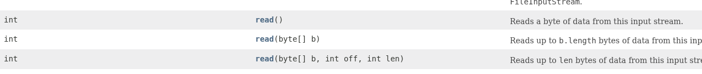
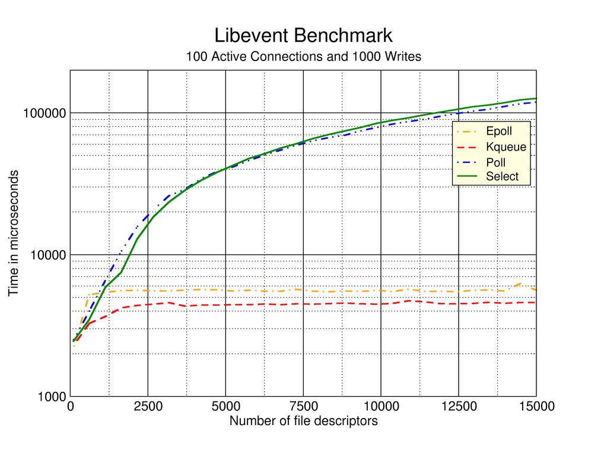
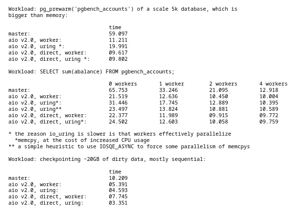

Speakers
---

<!-- column_layout: [1, 1] -->

<!-- alignment: center -->

<!-- column: 0 -->


_Jean-Eudes Couignoux (capco)_

<!-- column: 1 -->

_Youssef Nait Belkacem (freelance)_


<!-- end_slide -->

Sommaire
---
* Introduction
* Quelques concepts linuxiens
* Présentation d'API linux
    * select
    * poll
    * epoll / kqueue
    * IO uring
* IO uring et le monde Java
* Conclusion

<!-- end_slide -->
Introduction
---
Le WEB aujourd'hui
----
<!-- column_layout: [1, 1] -->
<!-- column: 0 -->


<!-- column: 1 -->


<!-- end_slide -->
Introduction
---
Le WEB aujourd'hui
----
<!-- column_layout: [1, 1] -->
<!-- column: 0 -->

<!-- column: 1 -->


<!-- end_slide -->
Introduction
---
<!-- jump_to_middle -->

Everything is a file
===

<!-- end_slide -->

Api FileInputStream en java
===

<!-- jump_to_middle -->



<!-- end_slide -->

Exemple simple
---

``` bash
cat hello.txt
```

``` bash 
...
openat(AT_FDCWD, "presentation/demo.txt", O_RDONLY) = 3
...
read(3, "Bonjour Paris JUG", 262144)    = 17
write(1, "Bonjour Paris JUG", 17Bonjour Paris JUG)       = 17
read(3, "", 262144)                     = 0
...
close(3)                                = 0
close(1)                                = 0
close(2)                                = 0
```

<!-- end_slide -->

Un exemple de Filedescriptor
---

```
pos:    256
flags:  02000002
mnt_id: 18
ino:    1091
```


<!-- end_slide -->
Objets linux représentés par un file descriptor
---

* fichier
* fichier virtuel (/proc, ...)
* socket
* terminal (0, 1 et 2)
* timers
* signaux
* process
* pipe nommé
* ...

<!-- end_slide -->
Linux Virtual File System
---


<!-- end_slide -->

<!-- jump_to_middle -->

Everything is a filedescriptor
===

<!-- end_slide -->
Exercice
---


<!-- end_slide -->
Exercice
---
<!-- column_layout: [1, 1] -->
<!-- column: 0 -->


<!-- column: 1 -->

<!-- end_slide -->
<!-- jump_to_middle -->
Demo
===
<!-- end_slide -->
API poll, caractéristiques
---

* Api posix (1)
* intégré au kernel dans la version 2.1.23 (1997)
* permet de surveiller plusieurs file descriptor
* quelques problèmes de scalabilité

<!-- end_slide -->
API poll, schéma
---


<!-- end_slide -->
API poll, schéma
---
<!-- column_layout: [1, 1] -->

<!-- column: 0 -->

<!-- column: 1 -->


<!-- end_slide -->
<!-- jump_to_middle -->
Demo
===
<!-- end_slide -->
API epoll, caractéristiques
---

* Api non posix (uniquement sous linux)
* intégré au kernel dans la version 2.5.44 (2002)
* permet de surveiller plusieurs file descriptor
* utilise une queue intégré au noyau pour gérer les évênements

<!-- end_slide -->
API epoll - Réception d'une nouvelle requête
---


<!-- end_slide -->
API epoll - Fin d'une requête
---


<!-- end_slide -->
API epoll - Attendre un évènement sur un file descriptor
---


<!-- end_slide -->
API epoll
---
<!-- column_layout: [1, 1] -->

<!-- column: 0 -->

<!-- column: 1 -->

<!-- end_slide -->
<!-- jump_to_middle -->
Demo
===
<!-- end_slide -->

API poll et epoll en java
---

Existe depuis java 1.6 avec la classe ```SelectorProvider```.

<!-- column_layout: [1, 1] -->

<!-- column: 0 -->

``` java
    Selector selector = Selector.open();
    ServerSocketChannel serverChannel = ServerSocketChannel.open();
    serverChannel.configureBlocking(false);
    serverChannel.bind(new InetSocketAddress("0.0.0.0", 8000));
    serverChannel.register(selector, SelectionKey.OP_ACCEPT);

    while (true) {
      // Attente des événements
      selector.select();
      // Récupération des clés prêtes
      Iterator<SelectionKey> keys = selector.selectedKeys().iterator();
      while (keys.hasNext()) {
        SelectionKey key = keys.next();
        keys.remove();


```

<!-- column: 1 -->

``` java
        if (key.isAcceptable()) {
          // Accepter une nouvelle connexion
          ServerSocketChannel server = (ServerSocketChannel) key.channel();
          SocketChannel clientChannel = server.accept();
          clientChannel.configureBlocking(false);
          clientChannel.register(selector, SelectionKey.OP_READ);
          System.out.println("Nouvelle connexion acceptée : " + clientChannel.getRemoteAddress());
        } else if (key.isReadable()) {
          // Lire les données du client
          SocketChannel clientChannel = (SocketChannel) key.channel();
          ByteBuffer buffer = ByteBuffer.allocateDirect(512);
          int bytesRead = clientChannel.read(buffer);
          if (bytesRead == -1) {
            // Le client a fermé la connexion
            clientChannel.close();
          } else {
            buffer.flip();
            String message = new String(buffer.array(), 0, buffer.limit());
            System.out.println("Message reçu : " + message);

            // Répondre au client
            clientChannel.write(ByteBuffer.wrap(("Message reçu : " + message + "\n").getBytes()));
          }
        }
      }
    }
```

<!-- reset_layout -->

On peut choisir l'implementation avec le propriété ```java.nio.channels.spi.SelectorProvider```

<!-- end_slide -->

API IO uring, caractéristiques
---

* Api non posix (uniquement sous linux)
* intégré au kernel dans la version 5.1 (2019)
* interface asynchrone permettant de manipuler les IO
* zero copy
* limite le nombre d'appel kernel

<!-- end_slide -->
API IO uring (schéma)
---
```
|                          user space                   |
|               +-------------------------------+       |
|               |     read / write, liburing    |       |
|               +-------------------------------+       |
|                    |                    ^             |
|                    v                    |             |
|    +-------------------+    +-------------------+     |
|    | Submission Queue  |    | Completion Queue  |     |
|    |   [SQE 1]         |    |   [CQE 1]         |     |
|----|   [SQE 2]         |----|   [CQE 2]         |-----|
|    +-------------------+    +-------------------+     |
|            |                        ^                 |
|            +----------+  +----------+                 |
|                       v  |                            |
|                     +--------+                        |
|                     | readv  |                        |
|                     +--------+                        |
|                    Kernel space                       |
```
<!-- end_slide -->
API IO uring (schéma)
---

<!-- end_slide -->
API IO uring
---
<!-- column_layout: [1, 1] -->

<!-- column: 0 -->


<!-- column: 1 -->

```
Client 1                              Serveur
|                                      |
|                                      |
|                             listen() -> listen_fd=3
|                                      |
|                             ring_submissing(Accept:3, UD:A)         
|                             submit_and_wait() ⏳        
|                                      |
|                                      |
|-------------- connect() ------------>|
|                             submit_and_wait() ====> [(UD:A, 4)]
|<------------- accept() ok -----------|
|                                      |
|   socket(fd=3)                       |  listen_fd=3
|   connecté à srv:port                |  client_fd=4 lié au client                           
|                              ring_submissing(Accept:3, UD:A)
|                              ring_submission(READ:4, UD:B)
|                              ring_submit_and_wait() ⏳
|                                      |
|----------- send("Hello") ----------->|
|                              submit_and_wait() ====> [(UD:B, 5)] le 5 correspond à la taille à lire du buffer      
|                              ring_submissing(Accept:3, UD:A)
|                              ring_submissing(Write:4, UD:C)
|                                      |
|                              ring_submit_and_wait() ⏳
|<---------- send("Hi!") --------------|
|                              submit_and_wait() ====> [(UD:C)] événement de retour de notre écrite
|                              ring_submission(READ:4, UD:B)     
|                              submit_and_wait() ⏳
|                                      |
|------------ close() ---------------->|
|                              submit_and_wait() ====> [UD:B, 0]       
|                              close(client_fd=4)
|                              submit_and_wait() ⏳
```
<!-- end_slide -->
<!-- jump_to_middle -->
Demo
===
<!-- end_slide -->
Comparatif des performances (select - poll - epoll - kqueue)
---


https://monkey.org/~provos/libevent/libevent-benchmark2.jpg

<!-- end_slide -->

Comparatif des performances (iouring)
---


https://www.postgresql.org/message-id/uvrtrknj4kdytuboidbhwclo4gxhswwcpgadptsjvjqcluzmah%40brqs62irg4dt
<!-- end_slide -->
IO uring et l'écosystème java
---

* intégré via le projet panama
* disponible avec netty (4.2)
    * vertx
    * quarkus (experimental)
    * micronaut

<!-- end_slide -->

Conclusion
---

<!-- end_slide -->


Merci
===
