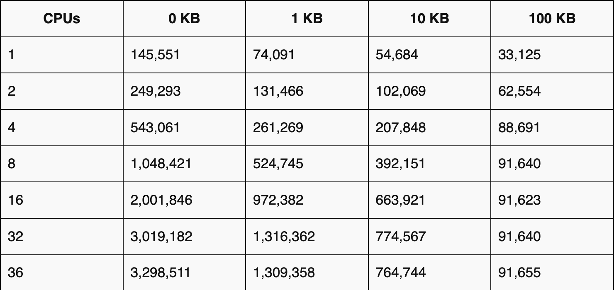

Speakers
---

<!-- column_layout: [1, 1] -->

<!-- column: 0 -->


_Jean-Eudes Couignoux (capco)_

<!-- column: 1 -->

_Youssef Nait Belkacem (freelance)_


<!-- end_slide -->

Sommaire
---
* Introduction
* Quelques concepts linuxiens
* Présentation d'API linux
    * select
    * poll
    * epoll / kqueue
    * IO uring
* IO uring et le monde Java
* Conclusion

<!-- end_slide -->
Introduction
---
Le WEB aujourd'hui
----


<!-- end_slide -->
Introduction
---
Le WEB aujourd'hui
----
<!-- column_layout: [1, 1] -->
<!-- column: 0 -->
```
          ┌─────────────┐
          │ WebSocket   │
          │   Server    │
          └─────^───────┘
                |
      ┌─────────|─────────┐
      │         |         │
┌─────v─────┐┌──v─────┐┌──v─────┐
│ Client 1  ││Client 2││Client 3│
└───────────┘└────────┘└────────┘
```
<!-- column: 1 -->
```
          ┌─────────────┐
          │     SSE     │
          │   Server    │
          └─────|───────┘
                |
      ┌─────────|─────────┐
      │         |         │
┌─────v─────┐┌──v─────┐┌──v─────┐
│ Client 1  ││Client 2││Client 3│
└───────────┘└────────┘└────────┘
```

<!-- end_slide -->
Introduction
---
Benchmark


Configuration:
CPU: 2x Intel(R) Xeon(R) CPU E5‑2699 v3 @ 2.30 GHz, 36 real (or 72 HT) cores
Network: 2x Intel XL710 40 GbE QSFP+ (rev 01)
Memory: 16 GB

Source : https://blog.nginx.org/blog/testing-the-performance-of-nginx-and-nginx-plus-web-servers
<!-- end_slide -->
Introduction
---
<!-- jump_to_middle -->

Possible grace aux API async IO de Linux
===

<!-- end_slide -->
<!-- jump_to_middle -->

Everything is a file
===

<!-- end_slide -->

Exemple simple
---

``` bash
cat hello.txt
```

``` bash 
...
openat(AT_FDCWD, "presentation/demo.txt", O_RDONLY) = 3
...
read(3, "Bonjour Paris JUG", 262144)    = 17
write(1, "Bonjour Paris JUG", 17Bonjour Paris JUG)       = 17
read(3, "", 262144)                     = 0
...
close(3)                                = 0
close(1)                                = 0
close(2)                                = 0
```

<!-- end_slide -->
Objets linux représentés par un file descriptor
---

* fichier
* fichier virtuel (/proc, ...)
* socket
* terminal (0, 1 et 2)
* timers
* signaux
* process
* pipe nommé
* ...

<!-- end_slide -->
Linux Virtual File System
---

```
+----------------+         +----------------+         +---------------------------+
|  Appels        |         |      VFS       |         |  +--------------------+   |
|  systèmes      |         | (Virtual File  |         |  | Fichier sur disque |   |
|                |         |   System)      |         |  +--------------------+   |
|  open          | ----->  |                | ----->  |  +--------------------+   |
|  read/write    |         |                | ----->  |  | Socket réseau      |   |
|  fchmod        |         |                | ----->  |  +--------------------+   |
|  ...           |         |                | ----->  |  +--------------------+   |
+----------------+         +----------------+         |  | Pipe / FIFO        |   |
                                                      |  +--------------------+   |
                                                      |  +--------------------+   |
                                                      |  | Fichier virtuel    |   |
                                                      |  | (/proc, /dev)      |   |
                                                      |  +--------------------+   |
                                                      +---------------------------+
```

<!-- end_slide -->

<!-- jump_to_middle -->

Everything is a filedescriptor
===

<!-- end_slide -->
Exercice
---

 ```          
+----------------+         +----------------+ 
|  Serveur       |         |      Client    |
|                |         |                | 
|                | connect |                | 
|                | <-----  |                | 
|                | text    |                | 
|                | ----->  |                | 
|                | text    |                | 
|                | <-----  |                | 
|                | disco   |                | 
|                | --//--  |                | 
+----------------+         +----------------+ 
```
<!-- end_slide -->
Exercice
---
<!-- column_layout: [1, 1] -->
<!-- column: 0 -->

```
          +-------------------+                  +-------------------+
          |     Client 1      |                  |     Client 2      |
          |-------------------|                  |-------------------|
          | socket(fd=3)      |                  |      socket(fd=3) |
          +-------------------+                  +-------------------+
                        \                            /
                         \                          /
                          \                        /
                           \                      /
                            \                    /
                             \                  /
                              \                /
                               \              /
                                \            /
                                 \          /
                                  \        /
                                   \      /
                                    \    /
                                     \  /
                                      \/
                             +-------------------+
                             |      Serveur      |
                             |-------------------|
                             | listen_fd = 3     |
                             | client1_fd = 4    |  <-- lié à Client 1
                             | client2_fd = 5    |  <-- lié à Client 2
                             +-------------------+

```
<!-- column: 1 -->
```
Client                                Serveur
|                                      |
|                                      |
|                             listen() -> listen_fd=3
|                                      |
|                                      |
|                                      |
|                                      |
|-------------- connect() ------------>|
|                                      |
|                             accept() -> client_fd=4
|<------------- accept() ok -----------|
|                                      |
|   socket(fd=3)                       |  listen_fd=3
|   connecté à srv:port                |  client_fd=4 lié au client
|                                      |
|----------- send("Hello") ----------->|
|                                      |
|<---------- send("Hi!") --------------|
|                                      |
|                                      |
|------------ close() ----------------->|
|                                      |
|                          close(client_fd=4)
|                                      |
|                                      |
```
<!-- jump_to_middle -->
Demo
===
<!-- end_slide -->
API poll, caractéristiques
---

* Api posix (1)
* intégré au kernel dans la version 2.1.23 (1997)
* permet de surveiller plusieurs file descriptor
* quelques problèmes de scalabilité

<!-- end_slide -->
API poll, schéma
---

```
Avant ajout :
+-----------------------------+
|         poll fds[]          |
|-----------------------------|
|  [ fd1 ]  [ fd2 ]  [ fd3 ]  |  <-- tableau de pollfd surveillés
+-----------------------------+

Ajout d'une nouvelle socket (fd4) :
        |
        v
Ajout de fd4 dans le tableau fds[]
        |
        v
poll([fd1, fd2, fd3, fd4])
        |
        v
Après ajout :
+--------------------------------------+
|         poll fds[]                   |
|--------------------------------------|
|  [ fd1 ]  [ fd2 ]  [ fd3 ]  [ fd4 ]  |  <-- tableau de pollfd surveillés
+--------------------------------------+
```

<!-- end_slide -->
API poll, schéma
---
<!-- column_layout: [1, 1] -->

<!-- column: 0 -->
```
          +-------------------+                  +-------------------+
          |     Client 1      |                  |     Client 2      |
          |-------------------|                  |-------------------|
          | socket(fd=3)      |                  |      socket(fd=3) |
          +-------------------+                  +-------------------+
                        \                            /
                         \                          /
                          \                        /
                           \                      /
                            \                    /
                             \                  /
                              \                /
                               \              /
                                \            /
                                 \          /
                                  \        /
                                   \      /
                                    \    /
                                     \  /
                                      \/
                             +-------------------+
                             |      Serveur      |
                             |-------------------|
                             | listen_fd = 3     |
                             | client1_fd = 4    |  <-- lié à Client 1
                             | client2_fd = 5    |  <-- lié à Client 2
                             +-------------------+

```

<!-- column: 1 -->

```
Client                                Serveur
|                                      |
|                                      |
|                             listen() -> listen_fd=3
|                                      |
|                             poll([3]) ⏳        
|                                      |
|                                      |
|-------------- connect() ------------>|
|                             poll([3]) ====> [3*]
|                             accept() -> client_fd=4
|<------------- accept() ok -----------|
|                                      |
|   socket(fd=3)                       |  listen_fd=3
|   connecté à srv:port                |  client_fd=4 lié au client
|                              poll([3, 4]) ⏳
|                                      |
|----------- send("Hello") ----------->|
|                              poll([3, 4]) ====> [3, 4*]        
|<---------- send("Hi!") --------------|
|                              poll([3, 4]) ⏳         
|                                      |
|------------ close() ---------------->|
|                              poll([3, 4]) ====> [3, 4*]        
|                              close(client_fd=4)
|                              poll([3]) ⏳       
|                                      |
```

<!-- end_slide -->
<!-- jump_to_middle -->
Demo
===
<!-- end_slide -->
API epoll, caractéristiques
---

* Api non posix (uniquement sous linux)
* intégré au kernel dans la version 2.5.44 (2002)
* permet de surveiller plusieurs file descriptor
* utilise une queue intégré au noyau pour gérer les évênements

<!-- end_slide -->
API epoll - Réception d'une nouvelle requête
---

```
Avant ajout :
+-----------------------------+
|         epoll instance      |
|-----------------------------|
|  [ fd1 ]  [ fd2 ]  [ fd3 ]  |  <-- file descriptors surveillés
+-----------------------------+

Ajout d'une nouvelle socket (fd4) :
        |
        v
epoll_ctl(ADD, fd4)
        |
        v

Après ajout :
+--------------------------------------+
|         epoll instance               |
|--------------------------------------|
|  [ fd1 ]  [ fd2 ]  [ fd3 ]  [ fd4 ]  |  <-- file descriptors surveillés
+--------------------------------------+
```

<!-- end_slide -->
API epoll - Fin d'une requête
---

```
Avant suppression :
+--------------------------------------+
|         epoll instance               |
|--------------------------------------|
|  [ fd1 ]  [ fd2 ]  [ fd3 ]  [ fd4 ]  |  <-- file descriptors surveillés
+--------------------------------------+

Suppression d'une socket (fd3) :
        |
        v
epoll_ctl(DEL, fd3)
        |
        v

Après suppression :
+-----------------------------+
|         epoll instance      |
|-----------------------------|
|  [ fd1 ]  [ fd2 ]  [ fd4 ]  |  <-- file descriptors surveillés
+-----------------------------+
```
<!-- end_slide -->
API epoll - Attendre un évènement sur un file descriptor
---

```
+--------------------------------------+
|         epoll instance   EP1         |
|--------------------------------------|
|  [ fd1 ]  [ fd2 ]  [ fd3 ]  [ fd4 ]  |  <-- file descriptors surveillés
+--------------------------------------+

Attendre l'arrivée d'un évènement sur (fd3) :
        |
        v
epoll_wait(EP1)
        |
        v     
Après écriture sur fd3 le retour de la epoll_wait(EP1) : [ fd3 ]

```
<!-- end_slide -->
API epoll
---
<!-- column_layout: [1, 1] -->

<!-- column: 0 -->
```
          +-------------------+                  +-------------------+
          |     Client 1      |                  |     Client 2      |
          |-------------------|                  |-------------------|
          | socket(fd=3)      |                  |      socket(fd=3) |
          +-------------------+                  +-------------------+
                        \                            /
                         \                          /
                          \                        /
                           \                      /
                            \                    /
                             \                  /
                              \                /
                               \              /
                                \            /
                                 \          /
                                  \        /
                                   \      /
                                    \    /
                                     \  /
                                      \/
                             +-------------------+
                             |      Serveur      |
                             |-------------------|
                             | listen_fd = 3     |
                             | client1_fd = 4    |  <-- lié à Client 1
                             | client2_fd = 5    |  <-- lié à Client 2
                             +-------------------+

```

<!-- column: 1 -->

```
Client                                Serveur
|                                      |
|                                      |
|                             listen() -> listen_fd=3
|                                      |
|                             epoll_ctl(ADD, 3)         
|                             epoll_wait() ⏳        
|                                      |
|                                      |
|-------------- connect() ------------>|
|                             epoll_wait() ====> [3]
|                             accept() -> client_fd=4
|<------------- accept() ok -----------|
|                                      |
|   socket(fd=3)                       |  listen_fd=3
|   connecté à srv:port                |  client_fd=4 lié au client
|                              epoll_ctl(ADD, 4)
|                              epoll_wait() ⏳  
|                                      |
|----------- send("Hello") ----------->|
|                              epoll_wait() ====> [4]        
|<---------- send("Hi!") --------------|
|                              epoll_wait() ⏳         
|                                      |
|------------ close() ---------------->|
|                              epoll_wait() ====> [4]        
|                              close(client_fd=4)
|                              epoll_ctl(DEL, 4)        
|                              epoll_wait() ⏳
|                                      |
```
<!-- end_slide -->
<!-- jump_to_middle -->
Demo
===
<!-- end_slide -->

API poll et epoll en java
---

Existe depuis java 1.6 avec la classe ```SelectorProvider```.

<!-- column_layout: [1, 1] -->

<!-- column: 0 -->

``` java
    Selector selector = Selector.open();

    ServerSocketChannel serverChannel = ServerSocketChannel.open();
    serverChannel.configureBlocking(false);
    serverChannel.bind(new InetSocketAddress("0.0.0.0", 8000));

    serverChannel.register(selector, SelectionKey.OP_ACCEPT);

    while (true) {
      // Attente des événements
      selector.select();

      // Récupération des clés prêtes
      Iterator<SelectionKey> keys = selector.selectedKeys().iterator();

      while (keys.hasNext()) {
        SelectionKey key = keys.next();
        keys.remove();


```

<!-- column: 1 -->

``` java
        if (key.isAcceptable()) {
          // Accepter une nouvelle connexion
          ServerSocketChannel server = (ServerSocketChannel) key.channel();
          SocketChannel clientChannel = server.accept();
          clientChannel.configureBlocking(false);
          clientChannel.register(selector, SelectionKey.OP_READ);
          System.out.println("Nouvelle connexion acceptée : " + clientChannel.getRemoteAddress());
        } else if (key.isReadable()) {
          // Lire les données du client
          SocketChannel clientChannel = (SocketChannel) key.channel();
          ByteBuffer buffer = ByteBuffer.allocateDirect(512);
          int bytesRead = clientChannel.read(buffer);
          if (bytesRead == -1) {
            // Le client a fermé la connexion
            clientChannel.close();
          } else {
            buffer.flip();
            String message = new String(buffer.array(), 0, buffer.limit());
            System.out.println("Message reçu : " + message);

            // Répondre au client
            clientChannel.write(ByteBuffer.wrap(("Message reçu : " + message + "\n").getBytes()));
          }
        }
      }
    }
```

<!-- reset_layout -->

On peut choisir l'implementation avec le propriété ```java.nio.channels.spi.SelectorProvider```

<!-- end_slide -->

API IO uring, caractéristiques
---

* Api non posix (uniquement sous linux)
* intégré au kernel dans la version 5.1 (2019)
* interface asynchrone permettant de manipuler les IO
* zero copy
* limite le nombre d'appel kernel

<!-- end_slide -->
API IO uring (schéma)
---

```
+---------------------------------------------------------------------+
|                              user space                             |
|                                                                     |
|                   +-------------------------------+                 |
|                   |     read / write, liburing    |                 |
|                   +-------------------------------+                 |
|                        |                    ^                       |
|                        v                    |                       |
|        +-------------------+    +-------------------+               |
|        | Submission Queue  |    | Completion Queue  |               |
|        |   [SQE 1]         |    |   [CQE 1]         |               |
|--------|   [SQE 2]         |----|   [CQE 2]         |---------------|
|        |   [SQE 3]         |    |   [CQE 3]         |               |
|        +-------------------+    +-------------------+               |
|                |                        ^                           |
|                |                        |                           |
|                +----------+  +----------+                           |
|                           |  |                                      |
|                         +--------+                                  |
|                         | readv  |                                  |
|                         +--------+                                  |
|                                                                     |
|                        Kernel space                                 |
+---------------------------------------------------------------------+
```
<!-- end_slide -->
API IO uring (schéma)
---
```
    Demande d'écriture sur fd3 (fd3) :
        |
        v
    ring.submit([OP_WRITE,fd3,UD:X], buf)
        |
        |
        v
+--------------------------------------------+
|         IO uring instance SQ               |
|--------------------------------------------|
| [ ACCEPT:fd1, UD:A ] [ WRITE:fd3, UD:B ]   |  <-- Opération demandé sur la submission queue
+--------------------------------------------+
        |
        v
    ring.submit_and_wait()
        |
        v
    Après écriture sur fd3 (fd3) :
        |
        v
+-----------------------------+
|  IO uring instance CQ       |
|-----------------------------|
|  [ UD:A,20 ]                |  <-- Résultat des opérations exécutées dans la completion queue
+-----------------------------+
```
<!-- end_slide -->
API epoll
---
<!-- column_layout: [1, 1] -->

<!-- column: 0 -->
```
          +-------------------+                  +-------------------+
          |     Client 1      |                  |     Client 2      |
          |-------------------|                  |-------------------|
          | socket(fd=3)      |                  |      socket(fd=3) |
          +-------------------+                  +-------------------+
                        \                            /
                         \                          /
                          \                        /
                           \                      /
                            \                    /
                             \                  /
                              \                /
                               \              /
                                \            /
                                 \          /
                                  \        /
                                   \      /
                                    \    /
                                     \  /
                                      \
                             +-------------------+
                             |      Serveur      |
                             |-------------------|
                             | listen_fd = 3     |
                             | client1_fd = 4    |  <-- lié à Client 1
                             | client2_fd = 5    |  <-- lié à Client 2
                             +-------------------+

```

<!-- column: 1 -->

```
Client                                Serveur
|                                      |
|                                      |
|                             listen() -> listen_fd=3
|                                      |
|                             ring_submissing(Accept:3, UD:A)         
|                             submit_and_wait() ⏳        
|                                      |
|                                      |
|-------------- connect() ------------>|
|                             submit_and_wait() ====> [(UD:A, 4)]
|<------------- accept() ok -----------|
|                                      |
|   socket(fd=3)                       |  listen_fd=3
|   connecté à srv:port                |  client_fd=4 lié au client                           
|                              ring_submissing(Accept:3, UD:A)
|                              ring_submission(READ:4, UD:B)
|                              ring_submit_and_wait() ⏳
|                                      |
|----------- send("Hello") ----------->|
|                              submit_and_wait() ====> [(UD:B, 5)] le 5 correspond à la taille à lire du buffer      
|                              ring_submissing(Accept:3, UD:A)
                               ring_submissing(Write:4, UD:C)
                                       |
                               ring_submit_and_wait() ⏳
|<---------- send("Hi!") --------------|
|                              submit_and_wait() ====> [(UD:C)] événement de retour de notre écrite
                               ring_submission(READ:4, UD:B)     
                               submit_and_wait() ⏳
|                                      |
|------------ close() ---------------->|
|                              submit_and_wait() ====> [UD:B, 0]       
|                              close(client_fd=4)
|                              submit_and_wait() ⏳
```
<!-- end_slide -->
<!-- jump_to_middle -->
Demo
===
<!-- end_slide -->
Comparatif des performances (select - poll - epoll - kqueue)
---


https://monkey.org/~provos/libevent/libevent-benchmark2.jpg

<!-- end_slide -->

Comparatif des performances (poll - epoll)
---


https://www.postgresql.org/message-id/uvrtrknj4kdytuboidbhwclo4gxhswwcpgadptsjvjqcluzmah%40brqs62irg4dt
<!-- end_slide -->
IO uring et l'écosystème java
---

* intégré via le projet panama
* disponible avec netty (4.2)
    * vertx
    * quarkus (experimental)
    * micronaut

<!-- end_slide -->

Conclusion
---

<!-- end_slide -->


Merci
===
