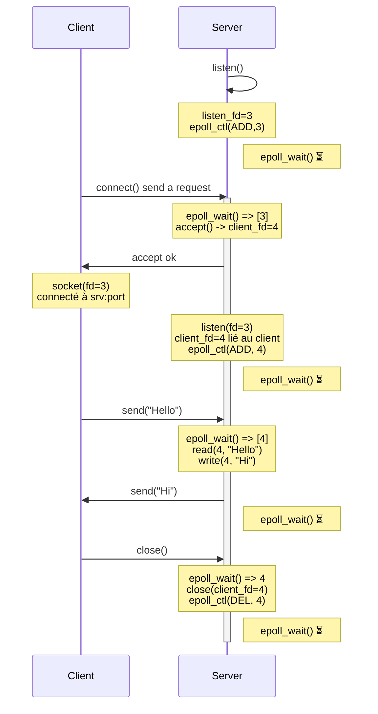

```
Client 1                              Serveur
|                                      |
|                                      |
|                             listen() -> listen_fd=3
|                                      |
|                             epoll_ctl(ADD, 3)         
|                             epoll_wait() ⏳        
|                                      |
|                                      |
|-------------- connect() ------------>|
|                             epoll_wait() ====> [3]
|                             accept() -> client_fd=4
|<------------- accept() ok -----------|
|                                      |
|   socket(fd=3)                       |  listen_fd=3
|   connecté à srv:port                |  client_fd=4 lié au client
|                              epoll_ctl(ADD, 4)
|                              epoll_wait() ⏳  
|                                      |
|----------- send("Hello") ----------->|
|                              epoll_wait() ====> [4]        
|<---------- send("Hi!") --------------|
|                              epoll_wait() ⏳         
|                                      |
|------------ close() ---------------->|
|                              epoll_wait() ====> [4]        
|                              close(client_fd=4)
|                              epoll_ctl(DEL, 4)        
|                              epoll_wait() ⏳
|                                      |
```

