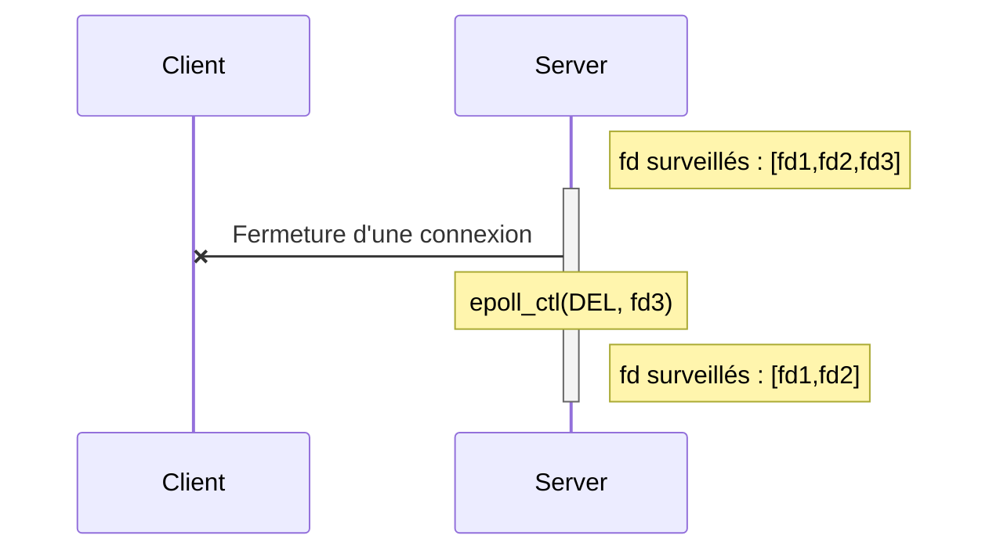

```mermaid
%%{ init: {"theme": "default",
           "themeVariables": { "wrap": "false", 'fontSize': '24px' },
           "flowchart": { "curve": "default",
                          "markdownAutoWrap":"false",
                          "wrappingWidth": "600" }
           }
}%%
sequenceDiagram

   participant C as Client
   participant S as Server

   Note right of S: fd surveillés : [fd1,fd2,fd3]
   activate S
   S-xC: Fermeture d'une connexion
   Note over S: epoll_ctl(DEL, fd3)
   Note right of S: fd surveillés : [fd1,fd2]
   deactivate S

```
