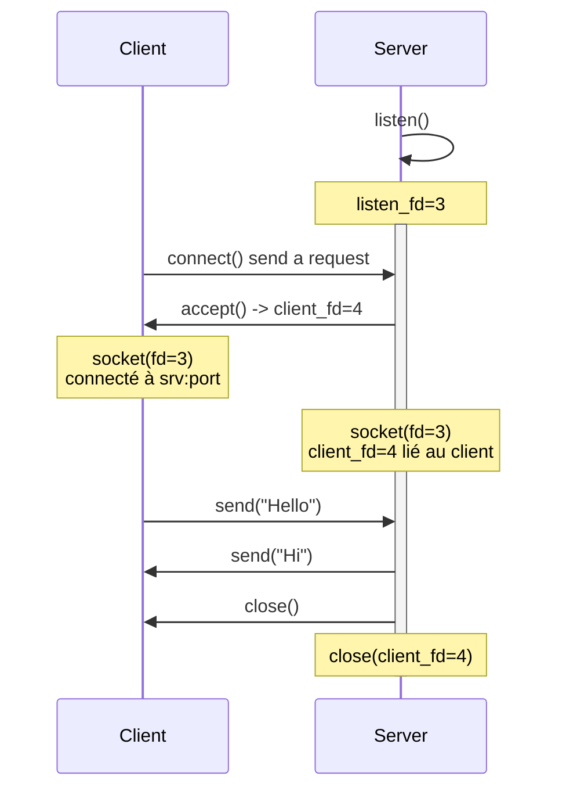

```
Client 1                             Serveur
|                                      |
|                                      |
|                             listen() -> listen_fd=3
|                                      |
|                                      |
|                                      |
|                                      |
|-------------- connect() ------------>|
|                                      |
|                             accept() -> client_fd=4
|<------------- accept() ok -----------|
|                                      |
|   socket(fd=3)                       |  listen_fd=3
|   connecté à srv:port                |  client_fd=4 lié au client
|                                      |
|----------- send("Hello") ----------->|
|                                      |
|<---------- send("Hi!") --------------|
|                                      |
|                                      |
|------------ close() ----------------->|
|                                      |
|                          close(client_fd=4)
|                                      |
|                                      |
```

