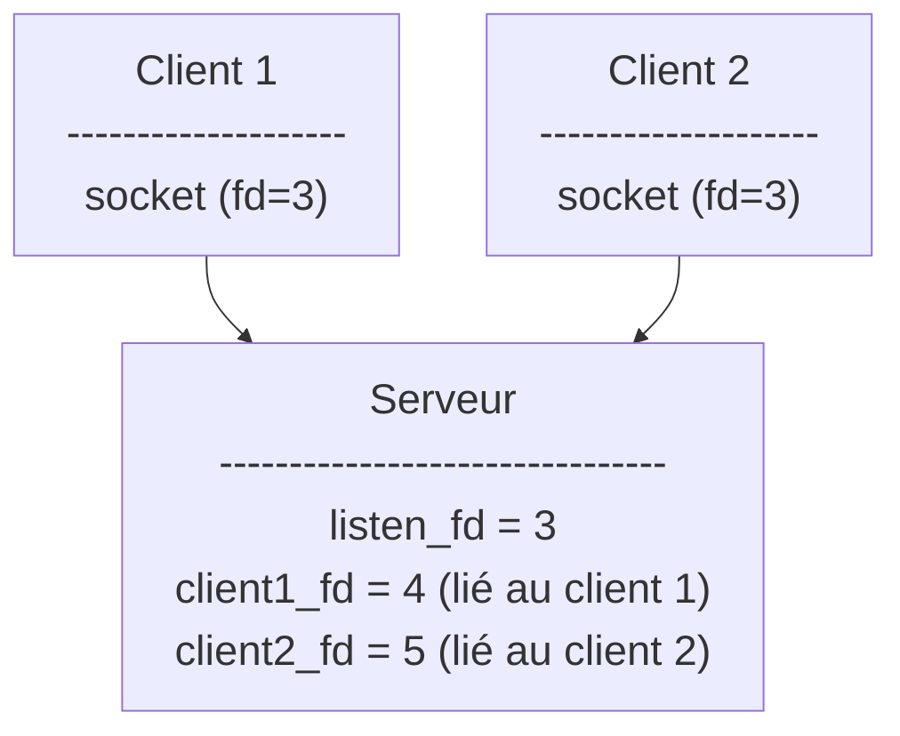

```mermaid
%%{ init: {"theme": "default",
           "themeVariables": { "wrap": "false", 'fontSize': '24px' },
           "flowchart": { "curve": "default",
                          "markdownAutoWrap":"false",
                          "wrappingWidth": "600" }
           }
}%%

flowchart TD
    client1["Client 1
    --------------------
    socket (fd=3)"]
    client2["Client 2
    --------------------
    socket (fd=3)"]
    server["
      Serveur
      --------------------------------
      listen_fd = 3
      client1_fd = 4 (lié au client 1)
      client2_fd = 5 (lié au client 2)
    "]
    client1--> server 
    client2--> server 
```
