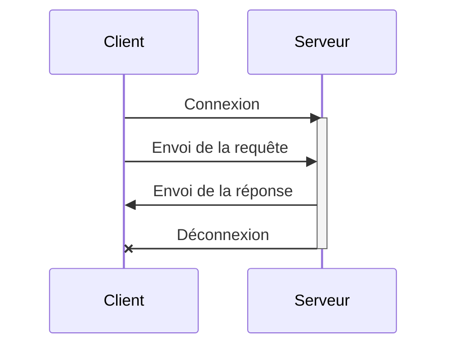

```mermaid
%%{ init: {"theme": "default",
           "themeVariables": { "wrap": "false", 'fontSize': '24px' },
           "flowchart": { "curve": "default",
                          "markdownAutoWrap":"false",
                          "wrappingWidth": "600" }
           }
}%%
sequenceDiagram
  participant client as Client
  participant server as Serveur
  client->>server: Connexion
  activate server
  client->>server: Envoi de la requête
  server->>client: Envoi de la réponse
  server-xclient: Déconnexion
  deactivate server
```
