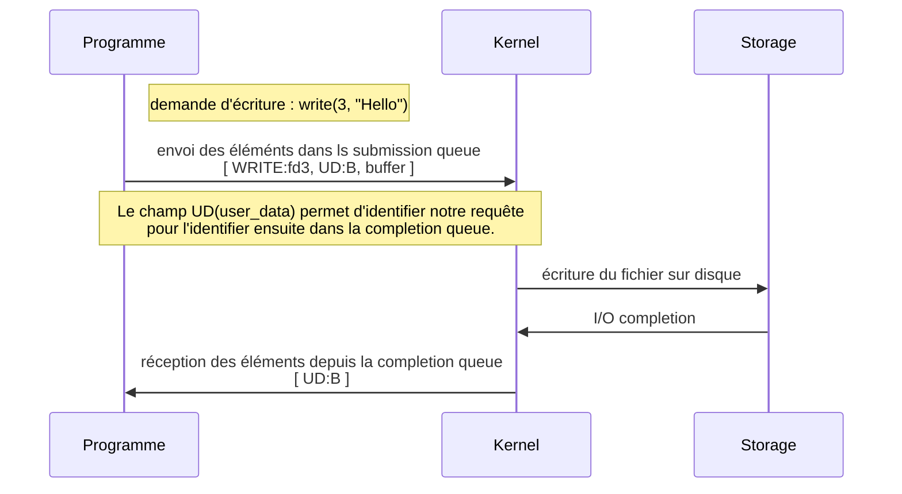

```mermaid
%%{ init: {"theme": "default",
           "themeVariables": { "wrap": "false", 'fontSize': '24px' },
           "flowchart": { "curve": "default",
                          "markdownAutoWrap":"false",
                          "wrappingWidth": "600" }
           }
}%%
sequenceDiagram

   participant S as Programme
   participant K as Kernel
   participant D as Storage
  

   Note right of S: demande d'écriture : write(3, "Hello")
   S->>K: envoi des éléménts dans ls submission queue<br/>[ WRITE:fd3, UD:B, buffer ]
   Note over S,K: Le champ UD(user_data) permet d'identifier notre requête<br/>pour l'identifier ensuite dans la completion queue.
   K->>D: écriture du fichier sur disque
   D->>K: I/O completion
   K->>S: réception des éléments depuis la completion queue<br/>[ UD:B ]

```
