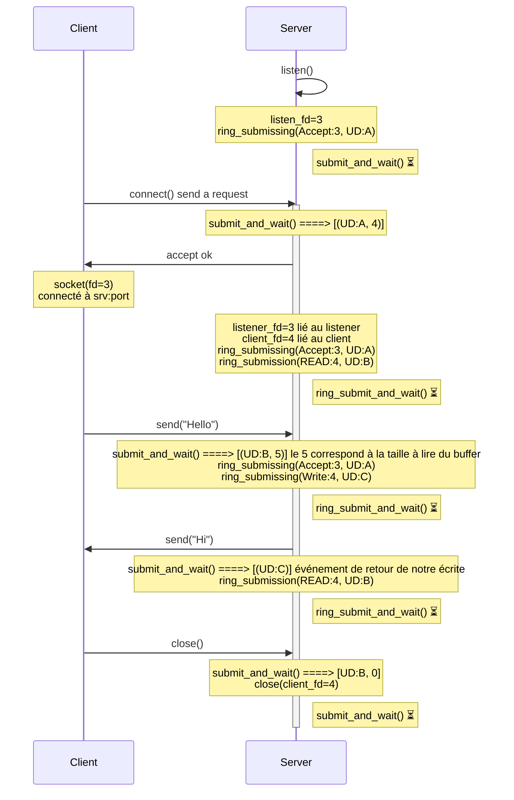

```
Client 1                              Serveur
|                                      |
|                                      |
|                             listen() -> listen_fd=3
|                                      |
|                             ring_submissing(Accept:3, UD:A)         
|                             submit_and_wait() ⏳        
|                                      |
|                                      |
|-------------- connect() ------------>|
|                             submit_and_wait() ====> [(UD:A, 4)]
|<------------- accept() ok -----------|
|                                      |
|   socket(fd=3)                       |  listen_fd=3
|   connecté à srv:port                |  client_fd=4 lié au client                           
|                              ring_submissing(Accept:3, UD:A)
|                              ring_submission(READ:4, UD:B)
|                              ring_submit_and_wait() ⏳
|                                      |
|----------- send("Hello") ----------->|
|                              submit_and_wait() ====> [(UD:B, 5)] le 5 correspond à la taille à lire du buffer      
|                              ring_submissing(Accept:3, UD:A)
|                              ring_submissing(Write:4, UD:C)
|                                      |
|                              ring_submit_and_wait() ⏳
|<---------- send("Hi!") --------------|
|                              submit_and_wait() ====> [(UD:C)] événement de retour de notre écrite
|                              ring_submission(READ:4, UD:B)     
|                              submit_and_wait() ⏳
|                                      |
|------------ close() ---------------->|
|                              submit_and_wait() ====> [UD:B, 0]       
|                              close(client_fd=4)
|                              submit_and_wait() ⏳
```