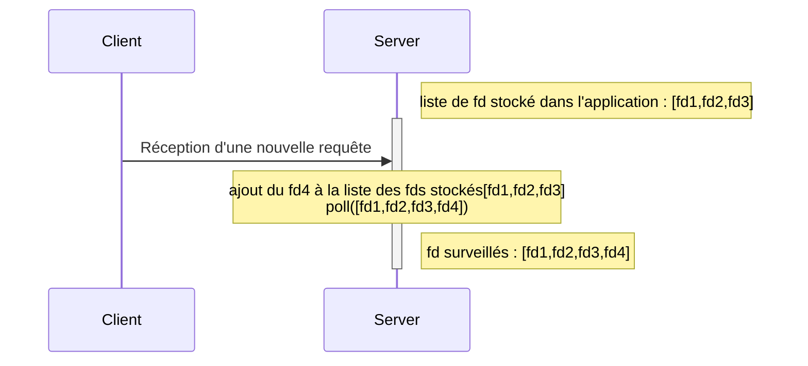

```mermaid
%%{ init: {"theme": "default",
           "themeVariables": { "wrap": "false", 'fontSize': '24px' },
           "flowchart": { "curve": "default",
                          "markdownAutoWrap":"false",
                          "wrappingWidth": "600" }
           }
}%%
sequenceDiagram

   participant C as Client
   participant S as Server

   Note right of S: liste de fd stocké dans l'application : [fd1,fd2,fd3]
   activate S
   C->>S: Réception d'une nouvelle requête
   Note over S: ajout du fd4 à la liste des fds stockés[fd1,fd2,fd3]<br/>poll([fd1,fd2,fd3,fd4])
   Note right of S: fd surveillés : [fd1,fd2,fd3,fd4]
   deactivate S

```
