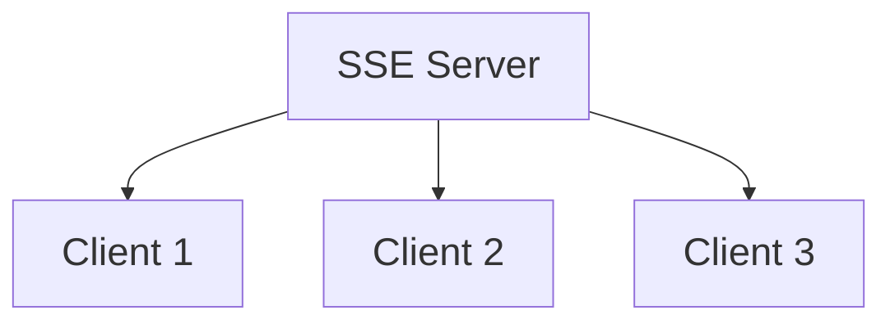

```mermaid
%%{ init: {"theme": "default",
           "themeVariables": { "wrap": "false", 'fontSize': '24px' },
           "flowchart": { "curve": "default",
                          "markdownAutoWrap":"false",
                          "wrappingWidth": "600" }
           }
}%%
flowchart TD
    sse["SSE Server"]
    client1["Client 1"]
    client2["Client 2"]
    client3["Client 3"]
    sse --> client1
    sse--> client2
    sse--> client3
```
