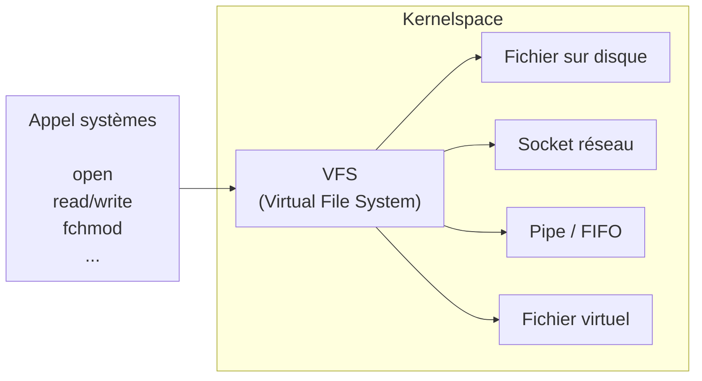

```mermaid
%%{ init: {"theme": "default",
           "themeVariables": { "wrap": "false", 'fontSize': '24px' },
           "flowchart": { "curve": "default",
                          "markdownAutoWrap":"false",
                          "wrappingWidth": "600" }
           }
}%%
flowchart LR
    client["Appel systèmes

    open
    read/write
    fchmod
    ..."]
    vfs["VFS
    (Virtual File System)
    "]
    diskFile["Fichier sur disque"]
    socket["Socket réseau"]
    pipe["Pipe / FIFO"]
    virtual["Fichier virtuel"]
    client-->vfs
    subgraph Kernelspace
    vfs-->diskFile
    vfs-->socket
    vfs-->pipe
    vfs-->virtual
    end
```
